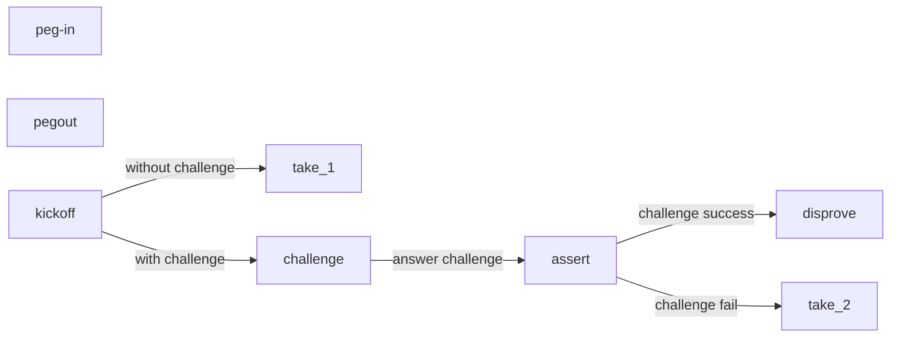

# BitVM PlayGround

A demo that demonstrates the basic process of BitVM2. 

For more details about BitVM2, please refer to [BitVM2 whitepaper](https://bitvm.org/bitvm_bridge.pdf)

We also prepared a [brief introduction](#introduction-to-bitvm2)

## Build

``` bash
cargo build
```

## Run BitVM instance

### 1. Initialization

The first step is to generate tapscripts&bitcommitments.

We provide an example groth16 proof in poc_data/dummy_proof.json and severval test accounts, so you don't need to config anything. 

We'll support custom proof in the near future.

To init, run:

``` bash
target/debug/bitvm_poc init
```
### 2. Run an instance

After initialization, you can create bitvm transactions and broadcast them. There are three diffrenece path for each BitVM instance, include:

### take_1
Take_1 corresponds to the situation where no challenge occurs.

Operator **kick_off**. No one **challenge**. After the challenge period, operator broadcast **take_1** to get his BTC.
```
peg-in ...... kick-off ---> take_1
```
Take_1 challenge period is set to 0 for convenience, actual period should be 7-days. 

To try take_1 path, run:
``` bash 
target/debug/bitvm_poc run take_1
```

### take_2
Take_2 corresponds to the situation where challenge failed.

Operator **kick_off**. Challenger **challenge**. Operator answer the challenge with **assert**. No response from challenger. After waiting for a certain period of time, operator broadcast **take_2** to get his BTC.
```
peg-in ...... kick-off ---> assert ---> take_2
                |
                 ----> challenge
```
Like take_1, take_2 waiting period is set to 0 for convenience, actual period should be 7-days. 

To try take_2 path, run:
``` bash 
target/debug/bitvm_poc run take_1
```

### disprove
Take_2 corresponds to the situation where challenge succeed.

Operator **kick_off**. Challenger **challenge**. Operator answer the challenge with **assert**. Challenger find the invalid assertion and then **disprove**. 
```
peg-in ...... kick-off ---> assert ---> disprove
                |
                 ----> challenge
```
To try disprove path, run: ( --index is optional, default: 1 )
``` bash
target/debug/bitvm_poc run disprove --index <INDEX>
```

## Introduction to BitVM2

BitVM2 is a novel paradigm that enables arbitrary program execution in Bitcoin,thereby combining Turing-complete expressiveness with the security of Bitcoin consensus. At its core, BitVM2 leverages optimistic computation, assuming operators are honest unless proven otherwise by challengers through fraud proofs, and SNARK proof verification scripts, which are split into sub-programs that are executed within Bitcoin transactions.

The protocol consists of five roles:
+ user: 
    - use peg-in to deposit into system
    - request peg-out to withdraw from system 
+ federation: 
    - create & pre-sign BitVM2 trasactions
    - they should discard privatekey after pre-sign is complete
    - at least one honest node is needed
+ operators: 
    - advance payment to users, seek reimbursement later
    - malicious behavior, say fake proof, will be challenged and punished
    - additional mechanisms are needed to ensure liveness
+ challenger: 
    - monitor the network for malicious operators
    - challenge malicious operator for reward
    - no access restrictions, anyone can challenge


The protocol can be simplified into serveral steps:


+  peg-in 
    1. Alice(user) want to deposit some BTC, she send request to federation
    2. federation generate corresponding BitVM2 trasation set and pre-sign
    3. operator pre-sign his part
    4. Alice verify these pre-signed txns, broadcast **peg-in** if it's ok

+ kickoff 
    1. Bob(user) want to withdraw some BTC, he send request to operator
    2. operator receive Bob's request, he advance BTC payment to Bob through **peg-out**
    3. operator then broadcast **kickoff** to seek reimbursement

+ take without challenge
    1. If no challenge during the challenge period(say 7-days), operator will be able to braodcast **take_1** and get BTC reimbursed 

+ challenge
    1. If some find/think operator is conducting malicious behavior, he can **challenge**
    2. operator must answer the challenge with **assert**, or he won't be able to get reimbursement
    3. **assert**'s witness contains a chunked SNARK proof, **assert**'s output contains a SNARK verifier(chunked into many tapscripts)
    4. If challenger found the error in the proof, he then broadcast **disprove** to slash operator
    5. If challenger fail to find any error to construct **disprove** during the waiting period(say 7-days), operator will be able to braodcast **take_2** and get BTC reimbursed 
      